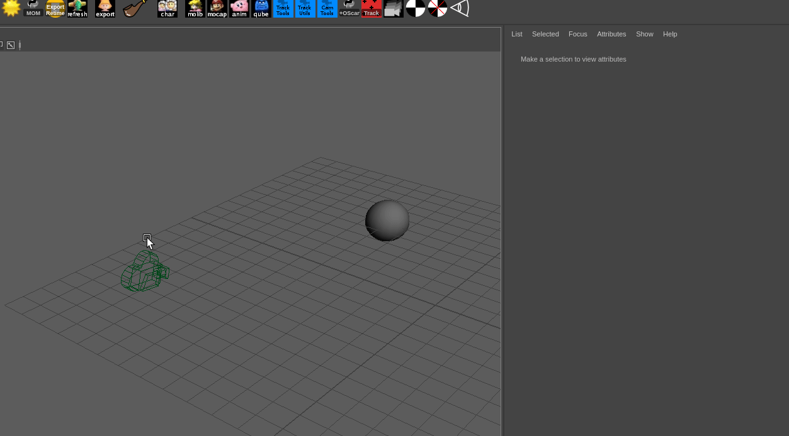

.. _guide:

======
Guide
======
This section will guide you through the basic usage of maya_focaloffset

Usage
======
Select a camera, then select your focal point object, and press the shelf button.
This will duplicate the camera and connect the output to our focal offset plugin.
Changing the output focal length edits the resulting position.

